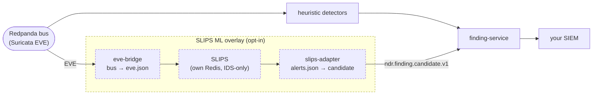

# ML behavioral detection (SLIPS) — opt-in

Cernity's built-in detectors are **heuristic and explainable** — strong on
C2/beaconing/DNS, but with no machine learning, so genuinely novel or anomalous
behavior with no matching heuristic can slip through. This overlay adds the
recognized open-source ML leg — [SLIPS](https://github.com/stratosphereips/StratosphereLinuxIPS)
(Stratosphere behavioral IPS) — over the **same** Suricata telemetry Cernity
already has, and routes its verdicts into the normal finding pipeline.

> **Status:** opt-in and early. This is the validation step toward a future
> Cernity-native ML detector.

## How it fits



Three small pieces, all central (nothing runs on the sensor):

- **`eve-bridge`** consumes the Suricata EVE already on Cernity's bus and writes a
  growing `eve.json` — the exact input SLIPS reads natively. No new sensor data.
- **SLIPS** (stock upstream image, its own Redis, IDS-only) profiles hosts and
  raises an **alert** once accumulated evidence for a host crosses its threshold.
- **`slips-adapter`** turns each SLIPS alert into a Cernity **candidate** on
  `ndr.finding.candidate.v1` — the same topic every heuristic detector emits to. From
  there a SLIPS verdict flows through the normal lifecycle: dedup, severity gate, MITRE
  mapping, delivery to your SIEM. The adapter tags the candidate by the SLIPS module's
  nature: a behavioral/ML module → `detector_id=slips_ml`, but a **blocklist / threat-intel
  lookup** module → `slips_intel` (that is the same *kind* of signal as Cernity's own
  threat_intel detector — a lookup, not ML). The originating module is carried on the
  finding for provenance.

Because SLIPS output re-enters the pipeline as an ordinary candidate, ML and
heuristic signals meet in the finding pipeline two ways:

- **ML-only → its own finding.** A SLIPS verdict with no matching heuristic stands
  up as its own finding — the novel-threat catch.
- **ML + heuristic agree → one boosted corroboration.** When a **genuine ML** SLIPS
  verdict (`slips_ml`) and a heuristic detector flag the **same entity + same behavior**
  within the correlation window, `correlation-service` emits a single **corroboration**
  finding (`detector_id=correlation_corroboration`) with elevated severity/confidence,
  citing both sources — so agreement reads as high confidence, not two disconnected
  alerts. A SLIPS **threat-intel/blocklist** verdict (`slips_intel`) does **not** qualify
  as the ML side — a lookup agreeing with a heuristic isn't independent ML backing. Tune
  which detectors count as "ML" with `CORROBORATION_ML_SOURCES` (default `slips_ml`).

## Enable it

```bash
docker compose -f deploy/central/docker-compose.yml \
               -f deploy/overlays/slips.yml up --build
```

That adds SLIPS, its Redis, and the two bridge services. With it off, Cernity is
byte-for-byte its normal self — this overlay is purely additive.

**What lands in your SIEM:** findings with `detector_id: "slips_ml"` (behavioral/ML
modules) or `"slips_intel"` (SLIPS blocklist/threat-intel lookups). Severity is derived
from SLIPS' threat level, category/ATT&CK from SLIPS' IDEA0 category (an ML hit with no
defensible technique is honestly tagged `anomaly` with no MITRE — never a fabricated one).

## What it costs

| | |
|---|---|
| **RAM** | ~8 GB for SLIPS + its own Redis ([maintainer reference](https://hub.docker.com/r/stratosphereips/slips)). |
| **CPU** | ~1–2 vCPU (fed flows, which is lighter than raw-pcap mode). |
| **Mode** | IDS-only — SLIPS does not block traffic here. |

## Tuning

The defaults are meant to be adjusted against your traffic:

- **`EVE_BRIDGE_TOPICS`** (`.env`) — which EVE event-types to forward to SLIPS.
- SLIPS threat-level → Cernity-severity and IDEA0-category → Cernity-category/ATT&CK
  maps live in `services/slips-adapter/slips_map.py` (`_THREAT_SEV`, `_CAT`) — edit
  them to match how you want ML findings ranked.
- Keep the SLIPS container long-lived (and/or persist its output volume) so it
  doesn't re-learn profiles and re-download threat-intel on every restart.

## Licensing

SLIPS is **GPLv2**. This overlay pulls it as its own upstream image; it is **not**
part of Cernity's PolyForm-licensed code. See
[THIRD-PARTY-NOTICES.md](../THIRD-PARTY-NOTICES.md).
